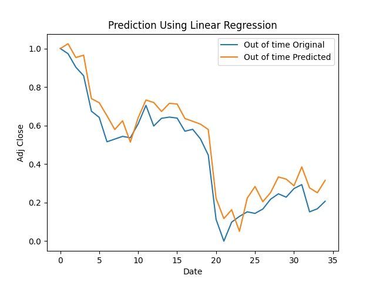
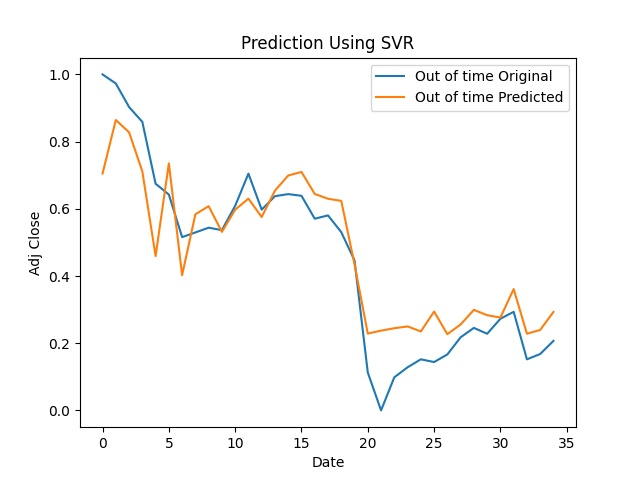
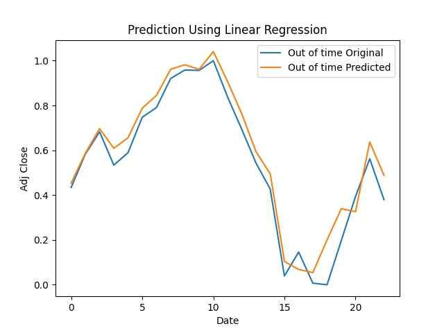
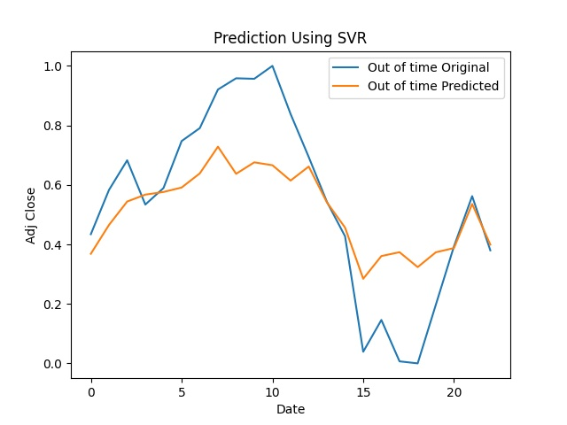
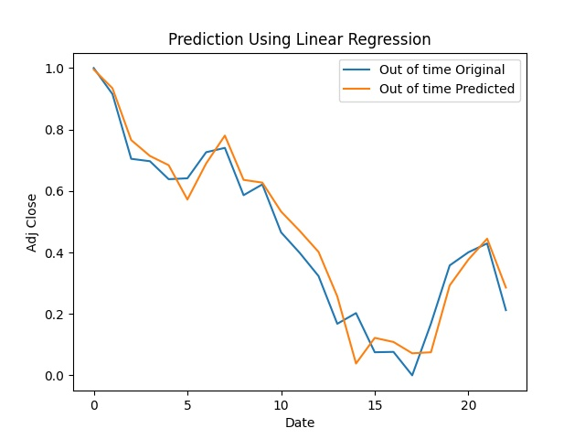
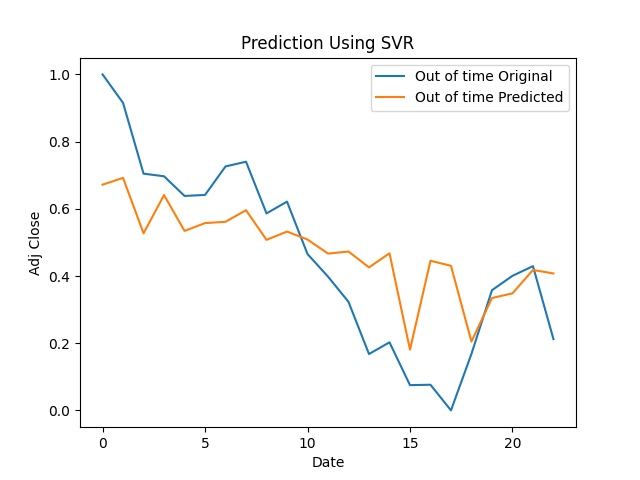

I have used 2 Regression models for prediction:
  1. Linear Regression
  2. Support Vector Regression
 
The accuracies achieved are as follows:

For BTC-Out of Time Dataset, following is the prediction result:
  1. Using Linear Regression:

  2. Using Support Vector Regression

For NSE-Out of Time Dataset, following is the prediction result:
  1. Using Linear Regression:

  2. Using Support Vector Regression

For NASDAQ-Out of Time Dataset, following is the prediction result:
  1. Using Linear Regression:

  2. Using Support Vector Regression

